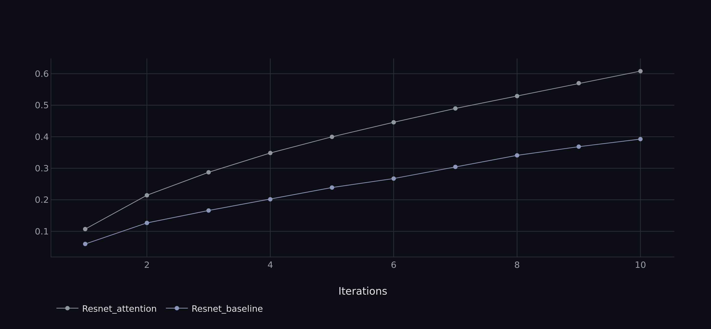
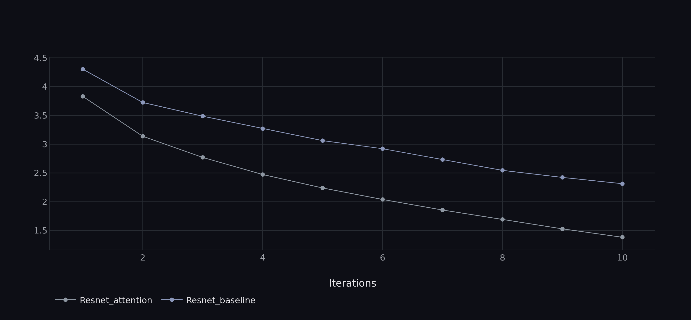

## About

This is an implementation of ResNet50 with channel attention mechanism 'from scratch'. The aim of the project is to demonstrate the practical implementation of channel attention in greater depth. Also here applied:
* Weight initialization (Kaiming);
* Early stopping;
* ... (see todo list)

## Training results

The launch was performed using the same parameters as in `config/config.py`.

## Todo
- [ ] Inference (with plotting);
- [x] Add dependecies;
- [x] Attention plotting;
- [ ] Parameterize ResNet depth;
- [x] Integration with MLFlow / ClearML;
- [x] Metrics (F-score, confusion matrix);
- [x] Comparison with default resnet;
- [ ] Optimization (ONNX);
- [ ] Add to readme after all.
